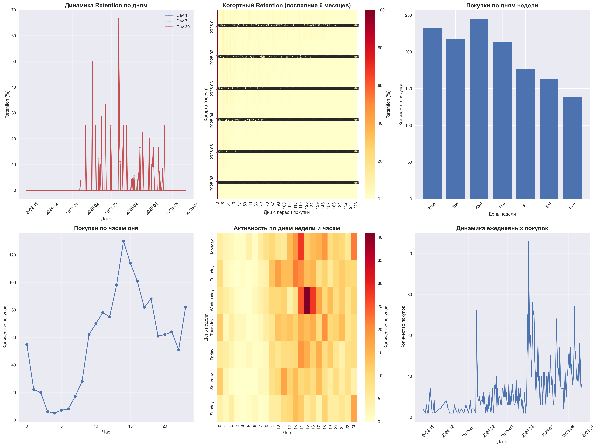

# Анализ ретеншна пользователей

## Обзор данных
- **Период анализа**: 24 октября 2024 - 21 июня 2025
- **Общее количество записей**: 1,386
- **Уникальных пользователей**: 855
- **Среднее количество покупок на пользователя**: 1.62

## Ключевые метрики ретеншна

### Rolling Retention
- **Retention Day 1**: 0.0% (критически низкий)
- **Retention Day 7**: 0.02% (очень низкий)
- **Retention Day 30**: 3.0% (низкий)

### Повторные покупки
- **Доля пользователей с повторными покупками**: 35.0%
- **Распределение по количеству покупок**:
  - 1 покупка: 65.0% (556 пользователей)
  - 2 покупки: 19.9% (170 пользователей)
  - 3-5 покупок: 13.3% (114 пользователей)
  - 6-10 покупок: 1.8% (15 пользователей)
  - 10+ покупок: 0.0% (0 пользователей)

## Анализ поведения

### Типы подписок
- **30 дней**: 90.9% (1,260 покупок)
- **90 дней**: 7.6% (106 покупок)
- **365 дней**: 1.4% (19 покупок)
- **180 дней**: 0.1% (1 покупка)

### Временные паттерны
- **Наиболее активные дни**: Среда (17.7%), Понедельник (16.7%), Вторник (15.7%)
- **Наименее активные дни**: Воскресенье (10.0%), Суббота (11.8%)
- **Пиковые часы**: 00:00 (4.0%), 09:00 (4.5%)

## Критические проблемы

1. **Критически низкий retention Day 1 (0%)** - пользователи не возвращаются на следующий день
2. **Низкий retention Day 7 (0.02%)** - практически нет недельного retention
3. **Низкий retention Day 30 (3%)** - очень мало пользователей возвращаются через месяц
4. **65% пользователей совершают только одну покупку** - проблема с повторными покупками

## Рекомендации по улучшению

### Приоритет ВЫСОКИЙ

#### 1. Onboarding и первое впечатление
- Создать пошаговый гайд для новых пользователей
- Настроить welcome-серию писем/уведомлений
- Добавить интерактивный тур по функционалу
- Создать систему достижений для первых действий

#### 2. Персональные уведомления
- Настроить персонализированные push-уведомления
- Создать систему email-маркетинга с сегментацией
- Внедрить A/B тестирование сообщений
- Добавить напоминания о неиспользованных функциях

### Приоритет СРЕДНИЙ

#### 3. Программа лояльности
- Создать систему бонусов и скидок
- Внедрить реферальную программу
- Добавить VIP-статусы для активных пользователей
- Создать календарь специальных предложений

#### 4. Контент и вовлечение
- Создать регулярный контент (блог, новости)
- Добавить геймификацию (очки, уровни)
- Внедрить социальные функции (отзывы, рейтинги)
- Создать сообщество пользователей

### Приоритет НИЗКИЙ

#### 5. Техническая оптимизация
- Улучшить производительность приложения
- Добавить офлайн-режим
- Оптимизировать процесс покупки
- Внедрить аналитику поведения пользователей

## Система измерения эффективности

1. **Еженедельные отчеты** по retention метрикам
2. **A/B тестирование** всех изменений
3. **Сегментация пользователей** по поведению
4. **Отслеживание конверсии** на каждом этапе воронки
5. **Регулярные опросы** пользователей

## Целевые показатели

### Краткосрочные (1-3 месяца)
- Retention Day 1: 0% → 15%
- Retention Day 7: 0.02% → 5%
- Доля повторных покупателей: 35% → 50%

### Среднесрочные (3-6 месяцев)
- Retention Day 30: 3% → 15%
- Среднее количество покупок: 1.62 → 2.5
- LTV (Lifetime Value): увеличить на 50%

### Долгосрочные (6-12 месяцев)
- Retention Day 30: 15% → 25%
- Доля пользователей с 5+ покупками: 1.8% → 10%
- Общий retention: стабильный рост на 2-3% в месяц

## Заключение

Текущие показатели ретеншна критически низкие и требуют немедленных действий. Основной фокус должен быть на улучшении onboarding процесса и создании системы уведомлений для удержания пользователей в первые дни после покупки.

## Визуализация данных

*Диаграммы показывают: динамику retention по дням, когортный анализ, распределение покупок по дням недели и часам, активность пользователей и тренды ежедневных покупок.*

Код для анализа доступен в файле `retention_analysis.py`.
