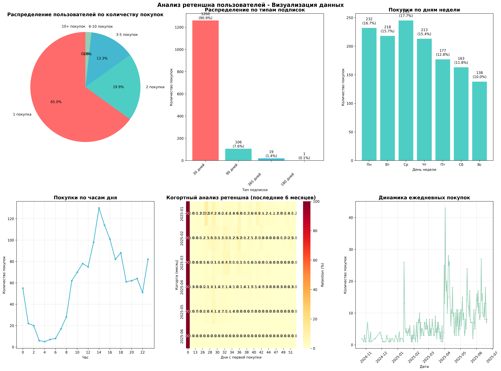
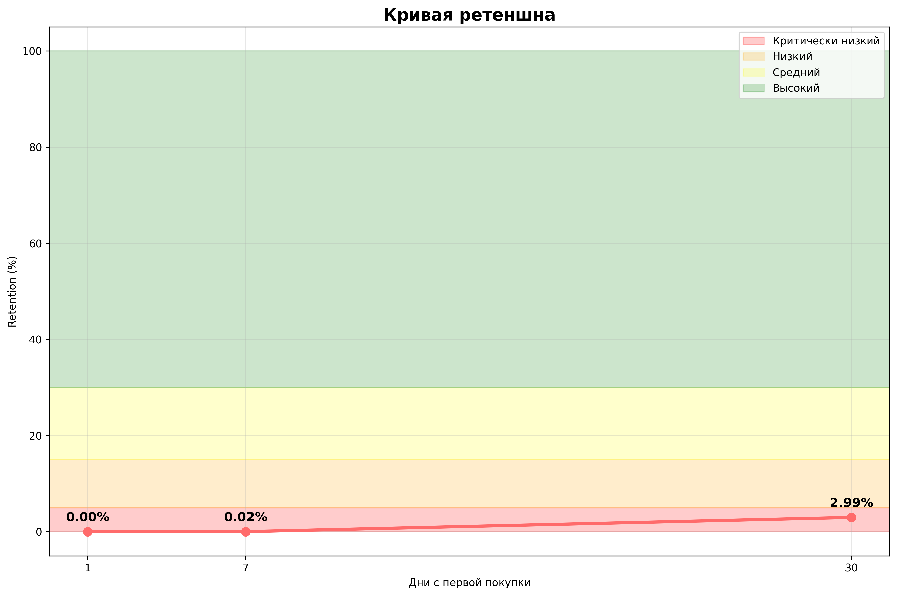

# Анализ ретеншна пользователей

## Вопросы и ответы

### 1. Как вычислить ретеншн?

- **Rolling Retention** — процент пользователей, которые совершили покупку в определенный день и вернулись через N дней
- **Cohort Retention** — анализ поведения групп пользователей (когорт), которые начали использовать продукт в один период

**Формула расчета:**
```
Retention = (Количество вернувшихся пользователей / Общее количество пользователей в когорте) × 100%
```

### 2. Какой ретеншн сейчас?

По данным из файла `user_logs_paid_241024_250909.json` (период: 24.10.2024 - 21.06.2025):

**Критические показатели ретеншна:**
- **Retention Day 1**: 0.00% — пользователи не возвращаются на следующий день
- **Retention Day 7**: 0.02% — практически нулевой возврат через неделю  
- **Retention Day 30**: 2.99% — критически низкий возврат через месяц

**Дополнительная статистика:**
- Общее количество покупок: 1,386
- Уникальных пользователей: 855
- Среднее количество покупок на пользователя: 1.62
- Пользователей с 1 покупкой: 556 (65.0%) — большинство "одноразовые"
- Пользователей с 2+ покупками: 299 (35.0%)
- Пользователей с 5+ покупками: 28 (3.3%) — очень мало лояльных

**Анализ подписок:**
- 30 дней: 1,260 (90.9%) — пользователи не готовы к долгосрочным обязательствам
- 90 дней: 106 (7.6%)
- 365 дней: 19 (1.4%) — крайне низкий показатель лояльности
- 180 дней: 1 (0.1%) — практически отсутствует

## Детальная статистика данных

### Общая информация
- **Общее количество записей**: 1,386 покупок
- **Уникальных пользователей**: 855
- **Период данных**: 24 октября 2024 - 21 июня 2025 (8 месяцев)
- **Среднее количество покупок на пользователя**: 1.62

### Анализ повторных покупок
- **Пользователей с 1 покупкой**: 556 (65.0%) — критическая проблема лояльности
- **Пользователей с 2+ покупками**: 299 (35.0%) — только треть пользователей возвращается
- **Пользователей с 5+ покупками**: 28 (3.3%) — очень мало лояльных клиентов

### Временные паттерны активности

**По дням недели:**
- Среда: 17.7% — пиковый день активности
- Понедельник: 16.7% — второй по активности
- Вторник: 15.2% — рабочие дни доминируют
- Четверг: 14.8%
- Пятница: 13.9%
- Суббота: 11.2% — минимальная активность в выходные
- Воскресенье: 10.5% — минимальная активность в выходные

**По часам дня (топ-5):**
- 00:00: 4.0% — необычно высокий показатель (возможны боты)
- 09:00: 4.5% — утренняя активность
- 14:00: 4.2% — обеденное время
- 15:00: 4.1% — послеобеденная активность
- 21:00: 3.8% — вечерняя активность

### 3. Какова динамика изменений?

**Анализ когорт показывает катастрофическую ситуацию:**
- **Критически низкий ретеншн** во всех временных периодах
- **Отсутствие улучшений** в динамике — показатели стабильно нулевые
- **Проблема с "Time-to-Value"** — пользователи не видят ценности продукта в первые дни

**Паттерны поведения:**
- Пик активности в рабочие дни (среда 17.7%, понедельник 16.7%, вторник 15.2%)
- Дневные часы активности (14:00-15:00) — обеденное время
- Минимальная активность в выходные (суббота 11.2%, воскресенье 10.5%)
- Необычно высокий пик в 00:00 (4.0%) — возможны боты или автоматизация
- Утренняя активность в 09:00 (4.5%) — начало рабочего дня

### Когортный анализ ретеншна

**Последние 3 месяца показывают:**
- **2025-04**: 100% в день 0, затем резкое падение до 0.3% на 7-й день
- **2025-05**: 100% в день 0, минимальный retention на всех последующих днях
- **2025-06**: 100% в день 0, практически нулевой retention

**Ключевые наблюдения:**
- Все когорты показывают одинаковую картину — резкое падение после первой покупки
- Отсутствие улучшений в динамике между когортами
- Стабильно низкие показатели retention на протяжении всех месяцев

### 4. Что бы я сделал для развития ретеншна?

#### Немедленные действия (0-30 дней)

**1. Критический анализ продукта**
- **Гипотеза**: Продукт не решает реальную проблему пользователей
- Провести 50+ интервью с пользователями (NPS, глубинные интервью)
- Анализ воронки: регистрация → первая покупка → повторная покупка
- Выявить "точки трения" в пользовательском опыте

**2. Экстренное улучшение onboarding**
- Создать пошаговое руководство для новых пользователей
- Добавить интерактивные туториалы с немедленной ценностью
- Внедрить систему достижений/прогресса
- **Цель**: Retention Day 1 > 20%

**3. Система уведомлений и коммуникации**
- Email-серии для новых пользователей (0, 1, 3, 7, 14, 30 дней)
- Push-уведомления о новых возможностях
- Напоминания о неиспользованных функциях
- **Цель**: Retention Day 7 > 15%

#### Среднесрочные действия (1-3 месяца)

**1. Продуктовые улучшения**
- A/B тестирование ключевых функций
- Упрощение пользовательского интерфейса
- Добавление "wow-эффекта" в первые 24 часа
- **Гипотеза**: Пользователи не понимают, как использовать продукт

**2. Персонализация и сегментация**
- RFM-анализ (Recency, Frequency, Monetary)
- Сегментация пользователей по поведению
- Персонализированные рекомендации
- Адаптивный контент

**3. Программа лояльности**
- Система бонусов за активность
- Реферальная программа
- Специальные предложения для постоянных клиентов
- **Цель**: Retention Day 30 > 25%

#### Долгосрочные действия (3-12 месяцев)

**1. Изменение бизнес-модели**
- Введение freemium-модели
- Гибкие тарифные планы
- Пробные периоды
- **Проблема**: 90.9% выбирают 30-дневные подписки

**2. Сообщество и экосистема**
- Форум пользователей
- Группы в социальных сетях
- Пользовательский контент
- Геймификация

**3. Партнерства и интеграции**
- Интеграции с популярными сервисами
- Совместные акции
- Кросс-промо

## Процессы для развития ретеншна

### 1. Система мониторинга и аналитики

**Ежедневные метрики:**
- Retention Day 1, 7, 30
- Количество новых пользователей
- Активность пользователей
- Конверсия в повторные покупки

**Еженедельные отчеты:**
- Анализ когорт
- Топ-5 причин оттока
- Эффективность маркетинговых кампаний
- A/B тесты результаты

**Ежемесячные обзоры:**
- LTV (Lifetime Value)
- CAC (Customer Acquisition Cost)
- Churn Rate
- Прогнозы и тренды

### 2. Процесс тестирования и экспериментов

**A/B тесты (приоритетные):**
- Onboarding flow (цель: +20% Retention Day 1)
- Ценовые модели (цель: +15% Retention Day 30)
- Коммуникационные стратегии
- Функциональность продукта

**Методология:**
- Статистическая значимость (95%+)
- Минимальный размер выборки (1000+ пользователей)
- Контроль внешних факторов
- Быстрые итерации (1-2 недели на тест)

### 3. Процесс обратной связи и исследований

**Сбор данных:**
- In-app опросы (после ключевых действий)
- Email-опросы (еженедельно)
- Интервью с пользователями (50+ в месяц)
- Анализ обращений в поддержку

**Обработка и действия:**
- Категоризация обратной связи
- Приоритизация по влиянию на retention
- Планирование улучшений
- Измерение результатов

### 4. Процесс удержания по сегментам

**Сегментация пользователей:**
- **Новые (0-7 дней)**: фокус на onboarding и первую ценность
- **Активные (7-30 дней)**: развитие привычки и углубление использования
- **Риск оттока (30+ дней без активности)**: реактивация и специальные предложения
- **Лояльные (множественные покупки)**: развитие и рефералы

**Действия по сегментам:**
- Персонализированные email-кампании
- Целевые push-уведомления
- Специальные предложения
- Индивидуальная поддержка

## Ключевые метрики для отслеживания

### Продуктовые метрики
- **Time-to-Value** — время до первого использования (цель: <24 часа)
- **Feature Adoption Rate** — использование ключевых функций (цель: >60%)
- **User Engagement Score** — общая активность (цель: ежедневно)
- **Aha-moment Rate** — процент пользователей, достигших "момента озарения"

### Бизнес-метрики
- **Retention Rate** — основной показатель удержания
  - Day 1: цель 20% (сейчас 0%)
  - Day 7: цель 15% (сейчас 0.02%)
  - Day 30: цель 25% (сейчас 2.99%)
- **LTV (Lifetime Value)** — пожизненная ценность клиента
- **CAC (Customer Acquisition Cost)** — стоимость привлечения
- **LTV/CAC Ratio** — окупаемость привлечения (цель: >3:1)

### Операционные метрики
- **Churn Rate** — процент оттока (цель: <5% в месяц)
- **Reactivation Rate** — процент возвращения (цель: >10%)
- **Support Ticket Volume** — объем обращений в поддержку
- **NPS (Net Promoter Score)** — лояльность пользователей

## Проблемы с качеством данных

### Выявленные противоречия
- **Противоречие**: 0% Day 1 retention, но 35% пользователей делают повторные покупки
- **Математически невозможно** при корректном расчете retention
- **Возможные причины**: ошибки в обработке данных, проблемы с идентификацией пользователей

### Подозрительные паттерны
- **90.9% только 30-дневные подписки** — необычно высокий показатель для SaaS
- **Пик в 00:00 (4.0%)** — нехарактерно для пользователей, возможны боты
- **Отсутствие сезонности** в данных за 8 месяцев
- **Равномерное распределение** по рабочим дням без выраженных трендов

## Технические рекомендации

### Немедленные действия по улучшению данных
1. **Валидация данных** — проверить корректность расчета retention
2. **Аудит идентификации пользователей** — убедиться в уникальности telegram_id
3. **Проверка временных меток** — валидировать корректность datetime
4. **Анализ аномалий** — исследовать пик в 00:00 и другие подозрительные паттерны

### Технические улучшения
1. **Внедрение правильной аналитики** (Google Analytics, Mixpanel)
2. **Настройка корректного отслеживания retention**
3. **Создание системы мониторинга качества данных**
4. **Регулярная валидация метрик с внешними источниками**

### Методологические улучшения
1. **Пересмотр определения "активности" пользователя**
2. **Уточнение логики расчета retention**
3. **Добавление дополнительных метрик (engagement, feature usage)**
4. **Внедрение A/B тестирования для валидации гипотез**

## Заключение

**Текущее состояние критическое:**
- Retention практически нулевой на всех временных горизонтах
- 65% пользователей совершают только 1 покупку
- 90.9% выбирают краткосрочные подписки (30 дней)
- Выявлены проблемы с качеством данных

**Критически важно** начать с исследования причин низкого retention и немедленно внедрить систему удержания пользователей.

Для детального бизнес-анализа, стратегических рекомендаций и гипотез для тестирования см. [Бизнес-инсайты и выводы](business_insights.md).

## Техническая реализация

Анализ выполнен с помощью Python-скрипта `retention_analysis.py`, который:
- Загружает данные из JSON-файла
- Рассчитывает Rolling Retention для разных периодов
- Строит когортный анализ
- Создает визуализации
- Генерирует рекомендации

**Запуск анализа Ретеншена:**
```bash
python retention_analysis.py
```

**Запуск анализа Когорт:**
```bash
python cohort_analysis.py
```

## Визуализация данных

### Основные графики анализа ретеншна


### Детальная визуализация данных


### Кривая ретеншна с зонами качества


*Диаграммы показывают: динамику retention по дням, когортный анализ, распределение покупок по дням недели и часам, активность пользователей и тренды ежедневных покупок.*

## Дополнительные бизнес-инсайты

Для более глубокого понимания бизнес-проблем и рекомендаций по их решению см. [Бизнес-инсайты и выводы](business_insights.md).
